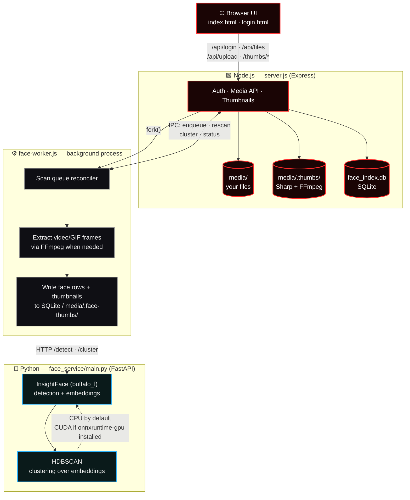

<div align="center">


<br/>


<br/><br/>

[](./LICENSE)
[](#-requirements)
[](#-requirements)
[](#-requirements)


</div>

<br/>

> Every "smart" photo app you've ever used was smart because a company somewhere was quietly building a searchable index of your face. **VaultOS gets you the same magic — browse your whole library by person, automatically — without a single byte ever leaving the machine it's running on.**

<br/>

<div align="center">

### 📚 Table of Contents

[Features](#-what-you-get) · [Architecture](#%EF%B8%8F-how-it-actually-works) · [Quick Start](#-quick-start) · [Configuration](#%EF%B8%8F-configuration) · [PM2](#-running-as-a-background-service) · [Structure](#-project-layout) · [Troubleshooting](#-troubleshooting) · [Philosophy](#-design-principles)

</div>

<br/>

---

## 🧠 What You Get

<table>
<tr>
<td width="50%" valign="top">

### 🖼️ A Real Media Gallery
- Unified grid for images, GIFs, and video
- Drag-and-drop uploads with live progress
- Fast thumbnails via Sharp + FFmpeg
- Favorites · Recent · Most Viewed, built in

</td>
<td width="50%" valign="top">

### 🧑‍🤝‍🧑 Face Intelligence, On-Device
- Full-library face detection, automatically
- AI clustering groups photos by *person*
- Manual correction when it gets something wrong
- New uploads join the scan queue on their own

</td>
</tr>
<tr>
<td width="50%" valign="top">

### 🔒 Privacy as the Default, Not a Setting
- Password-gated local web UI
- Hashed, authenticated routes — every request
- Not one API call ever leaves your network

</td>
<td width="50%" valign="top">

### ⚙️ Built to Run, Not Just to Demo
- One-command setup scripts
- Optional PM2 process management
- CPU by default, GPU acceleration opt-in
- No hardcoded paths — clone it anywhere

</td>
</tr>
</table>

<br/>

---

## 🏗️ How It Actually Works

VaultOS runs as **two cooperating services**: a Node/Express app that owns the UI, auth, media, and thumbnails — and a Python FastAPI microservice that owns the AI pipeline. Splitting them keeps the gallery snappy even while a full library scan is grinding away underneath it.



> [!TIP]
> **Why split it at all?** The CPU/GPU-heavy face-recognition work runs in its own Python process instead of blocking Node's event loop — so uploading, browsing, and scrubbing through video stay instant no matter how large a scan is running in the background.

<br/>

---

## 🚀 Quick Start

### Requirements

| | |
|---|---|
| **Required** | Windows 10/11, Linux, or macOS · Node.js 20 LTS+ · Python 3.10/3.11 · internet access on first run (model download) |
| **Recommended** | FFmpeg on `PATH` · 8 GB+ RAM for large libraries |
| **Optional** | NVIDIA GPU + `onnxruntime-gpu` for faster inference · PM2 for background deployment |

### One-Command Setup (Windows)

```powershell
git clone https://github.com/Rudra-Chitnis/VaultOS.git
cd VaultOS
Set-ExecutionPolicy -Scope Process Bypass
.\setup.ps1
.\start.ps1
```

`setup.ps1` checks your Node/Python versions, creates `.env`, prompts for a login password, creates required data directories, installs npm packages, sets up `face_service/venv`, installs Python dependencies, and warns you if FFmpeg is missing.

Then open:

```
http://localhost:8000
```

<details>
<summary><b>🔧 Prefer to do it by hand? Manual setup, step by step</b></summary>

<br/>

```powershell
copy .env.example .env
# edit PASS_HASH in .env — see Configuration below

npm ci

python -m venv face_service\venv
face_service\venv\Scripts\python.exe -m pip install --upgrade pip
face_service\venv\Scripts\python.exe -m pip install -r face_service\requirements.txt

npm start
```

</details>

<details>
<summary><b>🖥️ Running the AI service and the web app separately</b></summary>

<br/>

```powershell
# Terminal 1 — AI service
face_service\venv\Scripts\python.exe -m uvicorn face_service.main:app --host 127.0.0.1 --port 7860

# Terminal 2 — Web app
npm start
```

</details>

<details>
<summary><b>👀 Local UI review without a passphrase</b></summary>

<br/>

For a temporary local review without entering a login password, start VaultOS in a dedicated terminal with **both** explicit development flags set:

```powershell
$env:NODE_ENV = 'development'
$env:VAULTOS_DEV_AUTH_BYPASS = '1'
npm start
```

> [!WARNING]
> This disables the login screen entirely. Use it only on a trusted local machine, and never set `VAULTOS_DEV_AUTH_BYPASS` outside a throwaway development session.

</details>

<br/>

---

## ⚙️ Configuration

Copy `.env.example` → `.env`. **Never commit `.env`.**

| Variable | Purpose |
| :-- | :-- |
| `PASS_HASH` | Required SHA-256 hash of your login password |
| `PORT` | Node/Express port (default `8000`) |
| `FACE_SERVICE_URL` | URL the Node worker uses to reach the AI service (default `http://127.0.0.1:7860`) |
| `FACE_SERVICE_HOST` / `FACE_SERVICE_PORT` | Used by the start scripts and PM2 |
| `FACE_WORKER_CONCURRENCY` | Parallel face-worker jobs |
| `FACE_*` | Detection and clustering thresholds |

Generate a password hash:

```powershell
node -e "const c=require('crypto');console.log(c.createHash('sha256').update('YOUR_PASSWORD').digest('hex'))"
```

<br/>

---

## 🔁 Running as a Background Service

```powershell
npm install -g pm2
```

Once setup has run:

```powershell
npm run pm2:start     # start
npm run pm2:status    # check status
npm run pm2:logs      # tail logs
npm run pm2:restart   # restart
npm run pm2:stop      # stop
```

The bundled PM2 scripts point `PM2_HOME` at a repo-local, git-ignored `.pm2/` directory, so no machine-specific PM2 state leaks into the deployment. `ecosystem.config.js` is portable by default — repo directory as `cwd`, repo-local virtualenv for Python. Override the interpreter with:

```powershell
$env:VAULTOS_PYTHON = "C:\Path\To\python.exe"
```

<br/>

---

## 📁 Project Layout

```
VaultOS/
├─ server.js                Express app — auth, media API, thumbnails, worker lifecycle
├─ index.html                Main gallery UI
├─ login.html                 Login screen
├─ upload.js                   Upload modal + client-side logic
│
├─ face-worker.js            Background scan queue + face-indexing worker
├─ face-db.js                 SQLite schema + data-access helpers
├─ face-cluster.js             Incremental assignment + full-recluster writer
├─ face-infer.js                Deprecated v1 ONNX path (kept for reference)
├─ face-logger.js                Face subsystem logger
│
├─ face_service/              Python FastAPI AI microservice
│  ├─ main.py                   /health · /detect · /cluster
│  ├─ detector.py                 InsightFace detector/embedder
│  ├─ clusterer.py                  HDBSCAN clustering pipeline
│  └─ requirements.txt                Python dependencies
│
├─ face_models/               Legacy model notes (ONNX binaries are git-ignored)
├─ media/                      Your files + generated state (git-ignored)
│
├─ setup.ps1                  Fresh-clone setup script
├─ start.ps1                   Starts the AI service + Node server together
├─ ecosystem.config.js          Optional PM2 configuration
└─ .env.example                   Safe configuration template
```

<br/>

---

## 🗂️ Data & Git Policy

Kept out of version control by design — every single one of these is either a secret or fully regenerable:

| Path | Why it's ignored |
|---|---|
| `.env` | Secrets |
| `media/` | Your actual files |
| `media/.thumbs/`, `media/.face-thumbs/` | Generated thumbnails + face chips |
| `media/face_index.db*` | SQLite database + WAL files |
| `node_modules/`, `face_service/venv/`, `__pycache__/` | Regenerable dependencies |
| ONNX / model binaries | Fetched on demand |

> [!NOTE]
> InsightFace downloads its model weights to a user-level cache (typically `~/.insightface/models/buffalo_l/`) the first time it runs — that's the only network call VaultOS ever makes, and it happens exactly once.

<br/>

---

## 🩺 Troubleshooting

<details>
<summary><b>Python packages fail to build</b></summary>
<br/>
Use Python 3.10 or 3.11 — some dependencies don't yet support 3.12.
</details>

<details>
<summary><b>No video thumbnails / video face scan fails</b></summary>
<br/>
Install FFmpeg and make sure it's on <code>PATH</code> (<code>winget install Gyan.FFmpeg</code> on Windows), then restart your terminal.
</details>

<details>
<summary><b>"AI service unavailable"</b></summary>
<br/>
Confirm <code>FACE_SERVICE_URL</code> in <code>.env</code> matches the running port, and check <code>http://127.0.0.1:7860/health</code> directly in a browser.
</details>

<details>
<summary><b>Face inference stuck on CPU</b></summary>
<br/>
That's expected with the default <code>onnxruntime</code>. For GPU acceleration, swap in <code>onnxruntime-gpu</code> with a matching CUDA/cuDNN install.
</details>

<details>
<summary><b>Port already in use</b></summary>
<br/>
Change <code>PORT</code> or <code>FACE_SERVICE_PORT</code> in <code>.env</code>, keeping <code>FACE_SERVICE_URL</code> aligned with the new port.
</details>

<details>
<summary><b>Permission errors on Windows</b></summary>
<br/>
Run <code>Set-ExecutionPolicy -Scope Process Bypass</code> and confirm the project directory is writable.
</details>

<details>
<summary><b>Model download fails on first run</b></summary>
<br/>
InsightFace needs internet access the first time it runs. If you're behind a proxy, set <code>HTTPS_PROXY</code>.
</details>

<br/>

---

## 🧭 Design Principles

```
  Clone-and-run.      Works from any path. Runtime directories are created
                       automatically. Machine-specific values live only in
                       local .env, local shell config, or PM2 overrides —
                       never in source.

  CPU-first,           The default install runs entirely on CPU.
  GPU-optional.        GPU acceleration is an explicit opt-in, never
                       a requirement.

  Local by default,    No telemetry. No cloud AI calls. No external
  always.              face database. Full stop.
```

<br/>

---

<div align="center">

### 🤝 Contributing

Contributions are welcome — read **[CONTRIBUTING.md](./CONTRIBUTING.md)** first.
Keep changes focused and portable, never commit secrets or generated data, and validate with `node --check` / `python -m py_compile` before opening a PR.

<br/>

Licensed under the **[ISC License](./LICENSE)**.

<br/>

*Built for people who want their photo library to be smart — not surveilled.*

**[Rudra Chitnis](https://github.com/Rudra-Chitnis)**


</div>

